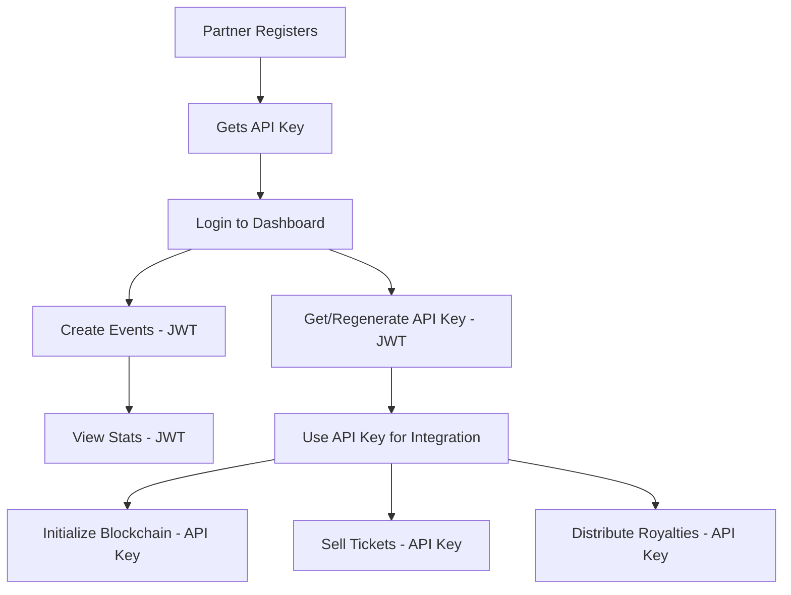

# Implementation Summary

## ✅ Completed Tasks

### 1. **API Key Authentication System**
- ✅ Created `ApiKeyStrategy` for Bearer token validation
- ✅ Created `ApiKeyGuard` for route protection
- ✅ Registered strategy in `AuthModule`
- ✅ Installed `passport-http-bearer` dependency

### 2. **Database & Services**
- ✅ Added `findByApiKey()` method to `UsersService`
- ✅ Added `findByIdWithApiKey()` method to `UsersService`
- ✅ Added `getApiKey()` method to `AuthService`
- ✅ Added `regenerateApiKey()` method to `AuthService`

### 3. **Auth Controller Endpoints**
- ✅ `GET /api/v1/auth/api-key` - Retrieve API key (JWT protected)
- ✅ `POST /api/v1/auth/regenerate-key` - Regenerate API key (JWT protected)

### 4. **Events Controller Updates**
- ✅ `POST /events/:id/initialize-blockchain` - Now uses API Key auth
- ✅ `POST /events/:id/distribute` - Now uses API Key auth
- ✅ Kept JWT auth for: Create, Update, Delete, Stats, Escrow

### 5. **Tickets Controller Updates**
- ✅ `POST /events/:eventId/tickets` - Now requires API Key auth (was public before!)

### 6. **Documentation**
- ✅ Created comprehensive `API_KEY_GUIDE.md`
- ✅ Includes examples, best practices, and SDK code

---

## 🎯 Authentication Flow

### **Partner Dashboard (JWT)**
```
1. Partner logs in → Gets JWT token
2. Creates events via dashboard
3. Views event statistics
4. Retrieves API key
```

### **API Integration (API Key)**
```
1. Partner uses API key from dashboard
2. Initializes events on blockchain
3. Sells tickets from their platform
4. Distributes royalties
```

---

## 🔐 Security Improvements

1. **API Key Format**: `sk_<32_characters>`
2. **Validation**: Checks format and database lookup
3. **Account Status**: Validates user is active
4. **Ticket Purchase**: Now requires authentication (was public before)

---

## 📡 New API Endpoints

| Method | Endpoint | Auth | Description |
|--------|----------|------|-------------|
| GET | `/api/v1/auth/api-key` | JWT | Get current API key |
| POST | `/api/v1/auth/regenerate-key` | JWT | Generate new API key |

---

## 🔄 Modified Endpoints

### **Events**
- `POST /events/:id/initialize-blockchain` - Changed from JWT to API Key
- `POST /events/:id/distribute` - Changed from JWT to API Key

### **Tickets**
- `POST /events/:eventId/tickets` - Added API Key requirement (was unprotected!)

---

## 🚀 Server Status

✅ **Server is running on:** http://localhost:3000
✅ **Swagger docs:** http://localhost:3000/api/docs
✅ **No compilation errors**

---

## 📋 Files Created/Modified

### **Created:**
- `src/auth/strategies/api-key.strategy.ts`
- `src/auth/guards/api-key.guard.ts`
- `API_KEY_GUIDE.md`

### **Modified:**
- `src/auth/auth.module.ts`
- `src/auth/auth.service.ts`
- `src/auth/auth.controller.ts`
- `src/users/users.service.ts`
- `src/events/events.controller.ts`
- `src/tickets/tickets.controller.ts`

---

## 🎨 Partner Dashboard Flow



---

## 🧪 Testing Commands

### **1. Register Partner**
```bash
curl -X POST http://localhost:3000/api/v1/auth/register \
  -H "Content-Type: application/json" \
  -d '{
    "email": "test@partner.com",
    "password": "password123",
    "walletAddress": "TestWalletAddress123"
  }'
```

### **2. Login**
```bash
curl -X POST http://localhost:3000/api/v1/auth/login \
  -H "Content-Type: application/json" \
  -d '{
    "email": "test@partner.com",
    "password": "password123"
  }'
```

### **3. Get API Key**
```bash
curl -X GET http://localhost:3000/api/v1/auth/api-key \
  -H "Authorization: Bearer <JWT_TOKEN>"
```

### **4. Use API Key**
```bash
curl -X POST http://localhost:3000/api/v1/events/EVENT_ID/initialize-blockchain \
  -H "Authorization: Bearer sk_abc123..."
```

---

## ✨ Next Steps (Optional Enhancements)

1. **Rate Limiting** - Add rate limits per API key
2. **Usage Tracking** - Log API calls per partner
3. **Webhooks** - Event notifications (ticket sold, etc.)
4. **Dashboard Endpoint** - Aggregate stats endpoint
5. **API Key Scopes** - Different permissions per key
6. **Key Expiration** - Optional expiry dates

---

## 📞 Questions?

Review the `API_KEY_GUIDE.md` for detailed documentation and examples!
